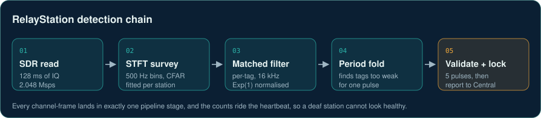

# RelayStation

Unattended VHF wildlife tag detection on a Raspberry Pi and a software-defined radio,
with a central server for the fleet.

> **This is a skeleton.** It is the real module layout, class and function signatures and
> docstrings of a private research codebase, with every function body replaced by `...`
> and all data, weights, configuration and credentials left out. It shows how the system
> is built; it does not run. The full code is private while the work is prepared for
> publication. Copyright Daniel Sambold, all rights reserved.



Radio tags on animals beep for about 19 ms every 1.7 s near 151 MHz. A station reads
128 ms of IQ at a time, surveys every channel, runs a per-tag matched filter, folds the
statistic at the beacon period to find tags too weak for a single pulse, and validates
the pulse train before it reports. Stations report over WiFi or NB-IoT cellular, queue
offline, and update themselves over the air with staging, verification and rollback.


On a synthetic-noise bench the rebuilt chain first validates a tag about 30 dB fainter
than the old Welch detector. Real sites have heavier-tailed noise than the bench, which
is why the gates calibrate themselves from each station's own data, and the outdoor
range walk that turns this into distance has not been redone.

## Built to fail loudly

Every channel-frame lands in exactly one pipeline stage and the counts ride the
heartbeat, so a station that is running but deaf shows up on the dashboard instead of
looking healthy. The clock steps from the server when there is no NTP, the modem has a
recovery ladder, and the watchdog keeps a persistent blackout clock.

## Layout

| Part | What it holds |
|---|---|
| `station/core/` | Survey DSP, CFAR gate, matched filter, period fold, pattern validator |
| `station/comms/` | Central client, offline queue, SIM7028 NB-IoT HTTP transport, clock sync |
| `station/health/`, `station/monitoring/` | Watchdog, modem recovery, telemetry |
| `central/server/` | FastAPI API, SQLite schema, alerts, diagnostics, range calibration |

```
station/
    comms/
    core/
    health/
    monitoring/
central/
    server/
```
